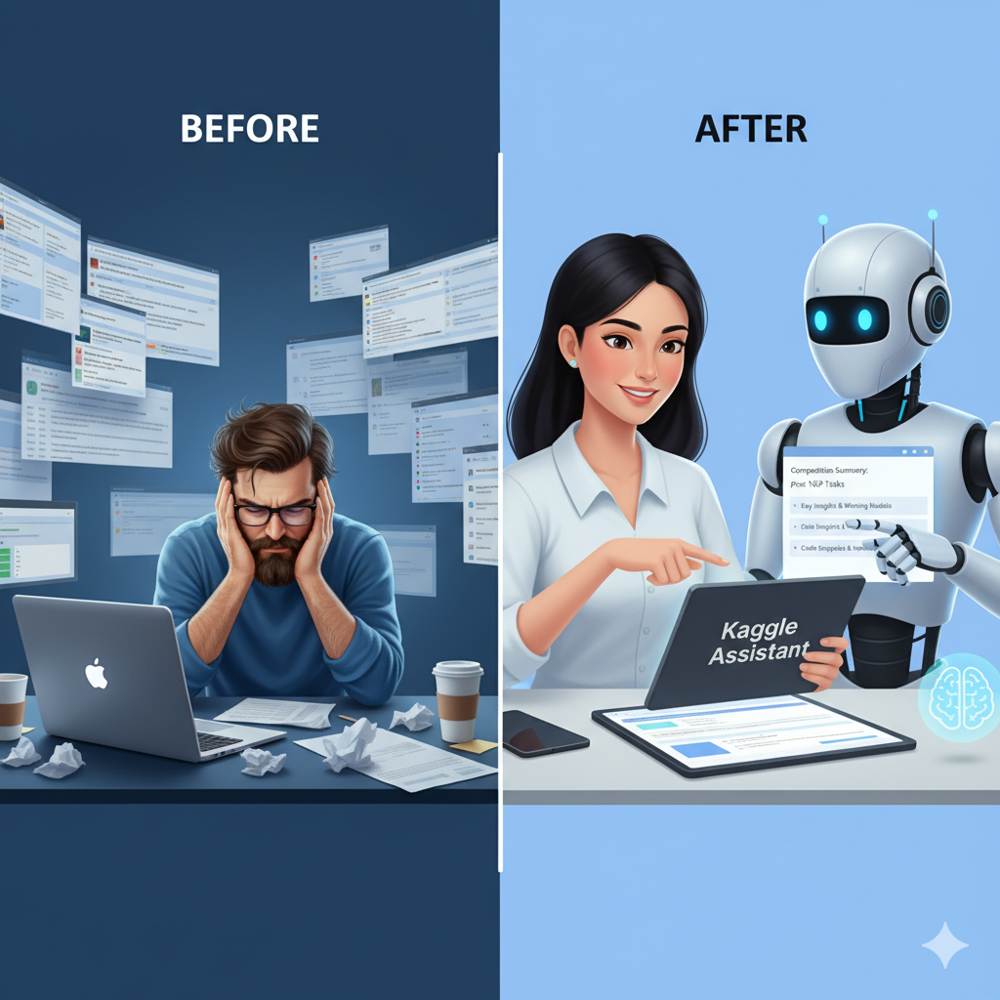

# Agentic AI Kaggle Competition Assistant

## Subtitle
A specialized AI agent that orchestrates custom tools to automate Kaggle competition research, accelerating the "cold start" phase for data scientists.

## Card and Thumbnail Image

## Submission Track
Enterprise Agents

## Media Gallery
*Replace with your YouTube video URL*
`https://www.youtube.com/watch?v=your-video-id`

## Project Description

### Problem Statement

Every Kaggle competition begins with a blank notebook and a daunting question: *"Where do I start?"*

Before a single model is trained, data scientists spend hours—often days—performing manual reconnaissance. They scour past competitions for similar problems, hunt for "winning solutions" buried in years-old discussion threads, and try to identify the state-of-the-art libraries for the specific task at hand. 

This process is **manual, repetitive, and inefficient**. Valuable insights are often missed simply because they are buried in the vast ocean of Kaggle's historical data (over 50,000 public datasets and competitions). This "cold start" problem is a significant bottleneck that slows down innovation and discourages newcomers. This project is solving the inefficiency of the research phase, turning hours of forum digging into minutes of automated insight gathering.

### Why agents?

A simple script or a traditional chatbot is insufficient for this problem for several reasons:

1.  **Non-Linear Workflows**: Research isn't a straight line. If an API call fails, or if a competition uses a unique metric, the system needs to adapt. An agent can reason: *"I couldn't find the competition by ID, so I will try searching by title, or parse the URL to extract the slug."*
2.  **Tool Orchestration**: The task requires chaining multiple distinct capabilities. To summarize a competition, one must first identify it, then fetch discussion topics, then retrieve code kernels, and finally synthesize the results. Agents are the perfect architecture for this "plan-and-execute" loop.
3.  **Real-Time Grounding**: A standard LLM hallucinates libraries or references non-existent kernels. An agent connected to the live Kaggle API provides **grounded, evidence-based answers**, citing specific real-world notebooks and authors.

Agents are the right solution because they bridge the gap between *reasoning* (understanding the user's strategic goal) and *doing* (interacting with the complex, structured data of the Kaggle platform).

### What you created

I created the **Agentic Kaggle Assistant**, a tool-using AI partner that automates the research lifecycle of a data science project.

**The Architecture:**
The system follows a modular, production-ready architecture designed for observability and extensibility:

1.  **The Brain (ReAct Engine)**: Built on **Google's Gemini 2.5 Flash**, the core agent implements a reasoning loop. It maintains conversation history (`ConversationMemory`) to allow for follow-up questions and manages the state of the session.
2.  **The Hands (API Layer)**: A robust Python interface wrapping the official **Kaggle API**. It handles authentication and data retrieval, ensuring the agent interacts securely with the platform.
3.  **The Skills (Custom Tools)**: I developed a suite of specialized tools that the agent can autonomously call:
    *   `find_similar_competitions`: Discovers strategically relevant past challenges.
    *   `get_winning_solution_writeups`: Mines forums for high-scoring approach explanations.
    *   `analyze_tech_stack`: Parses the source code of top notebooks (handling complex `.ipynb` JSON structures) to empirically determine the best libraries for the task.
    *   `search_code_snippets`: Performs semantic searches inside notebook code to find implementation details (e.g., "How was StratifiedKFold used?").
    *   `summarize_url_content`: A smart scraper with fallback capabilities (direct fetch -> web search) to digest competition landing pages.

### Demo

The solution works in two environments: as a **CLI tool** for quick interactive sessions and as a **Kaggle Notebook** for deep integration with the platform.

**Example Workflow:**
1.  **User**: "Summarize the Titanic competition."
2.  **Agent**: *Parses URL -> Extracts Slug -> Fetches Overview -> Fetches Winning Solutions -> Fetches Top Kernels -> Synthesizes Report.*
3.  **Agent Response**: "The Titanic competition asks you to predict survival outcomes. Key winning strategies involved feature engineering on 'Name' titles and using XGBoost. Top kernels include 'Titanic Data Science Solutions' by Manav Sehgal..."
4.  **User**: "Show me code for the feature engineering part."
5.  **Agent**: *Calls `search_code_snippets` for 'feature engineering' in the Titanic competition context -> Returns actual Python code blocks.*

You can view the functional prototype in the included `kaggle_assistant.ipynb` notebook.

### The Build

I built this assistant using a Python-first approach, prioritizing robustness and ease of deployment.

**Technologies Used:**
*   **Google Gemini 2.5 Flash**: The reasoning engine, chosen for its speed and long context window.
*   **Kaggle API**: For programmatic access to competitions, datasets, and kernels.
*   **Python (Pandas, BeautifulSoup)**: For data manipulation and HTML parsing.
*   **DuckDuckGo Search**: Implemented as a fallback tool; if the Kaggle API is unreachable or a page is protected, the agent seamlessly pivots to a web search to ensure the user always gets an answer.

**Key Implementation Highlight:**
One technical challenge was analyzing code inside Jupyter Notebooks. Standard tools treat `.ipynb` files as JSON. I wrote a custom parser in `src/kaggle_api.py` that extracts source code from specific cell types, allowing our agent to "read" notebooks just like a human data scientist would, enabling accurate tech stack analysis and snippet searching.

### If I had more time, this is what I'd do

1.  **Automated Starter Notebooks**: I would extend the agent to not just *find* code, but *assemble* it. The agent could generate a ready-to-run "starter notebook" containing data loading, basic EDA, and a baseline model based on the "winning solutions" it found.
2.  **Multi-Agent Collaboration**: I would split the system into specialized agents: a "Researcher" who finds papers/discussions, a "Coder" who writes the implementation, and a "Reviewer" who checks for bugs.
3.  **Vector Memory**: I would implement a vector database (like Chroma or Pinecone) to store embeddings of millions of code snippets. This would allow the agent to instantly recall "How to implement a Transformer for time series" from a vast library of past Kaggle solutions, rather than searching live every time.
